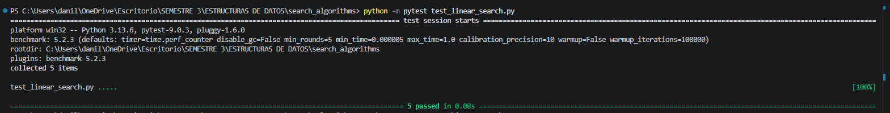
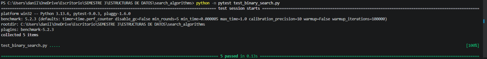
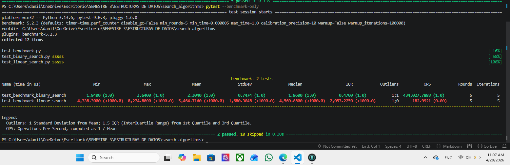

# 🔍 Search Algorithms

Repositorio que contiene la implementación y pruebas de algoritmos de búsqueda:

* Búsqueda Lineal
* Búsqueda Binaria

Además incluye pruebas unitarias y benchmarking utilizando `pytest`.

---

## 📥 Clonar el repositorio

```bash
git clone https://github.com/Danilocerna18/search_algorithms.git
cd search_algorithms
```

---

## 📦 Instalación de dependencias

Se recomienda instalar las siguientes dependencias:

```bash
pip install pytest pytest-benchmark
```

---

## 🧪 Ejecutar Unit Testing

python -m pytest test_linear_search.py
python -m pytest test_binary_search.py

Para ejecutar todas las pruebas unitarias:

```bash
pytest
```


Si todo está correcto, deberías ver:

```
12 passed
```

---

## ⚡ Ejecutar Benchmarking

Para ejecutar las pruebas de rendimiento:

```bash
pytest --benchmark-only
```

Esto evaluará:

* Búsqueda lineal
* Búsqueda binaria

En un escenario donde:

* Se utiliza una lista de 100,000 elementos
* El elemento buscado no existe

Se utiliza el modo **pedantic** con:

* 5 rounds
* 5 iteraciones por round

---

## 📊 Resultados esperados

El benchmark mostrará que:

* La búsqueda binaria es significativamente más rápida
* La búsqueda lineal tiene mayor tiempo de ejecución en listas grandes

---

## 📁 Estructura del proyecto

```
search_algorithms/
│
├── searching.py
├── test_linear_search.py
├── test_binary_search.py
└── test_benchmark.py
```

---


